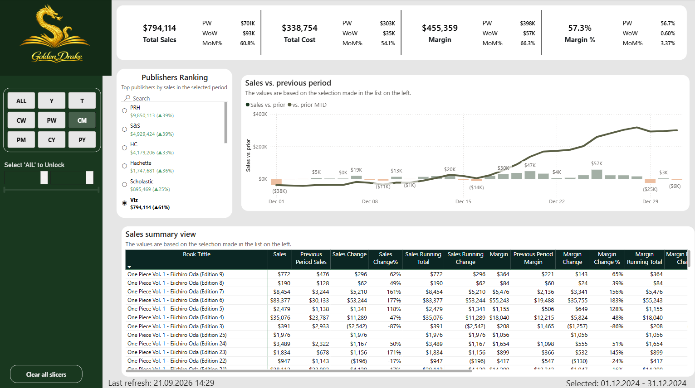
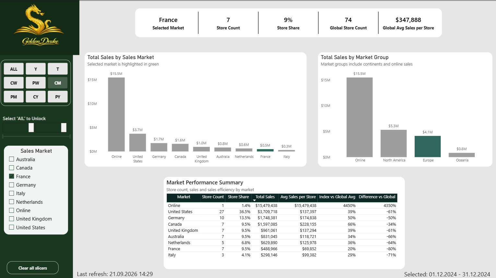
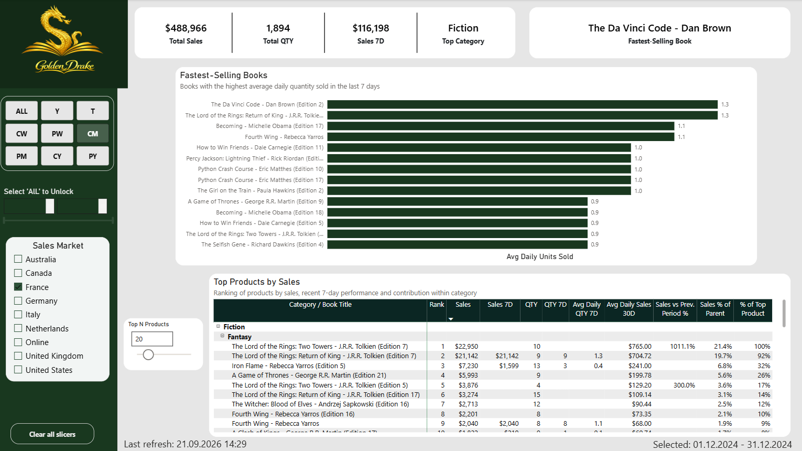
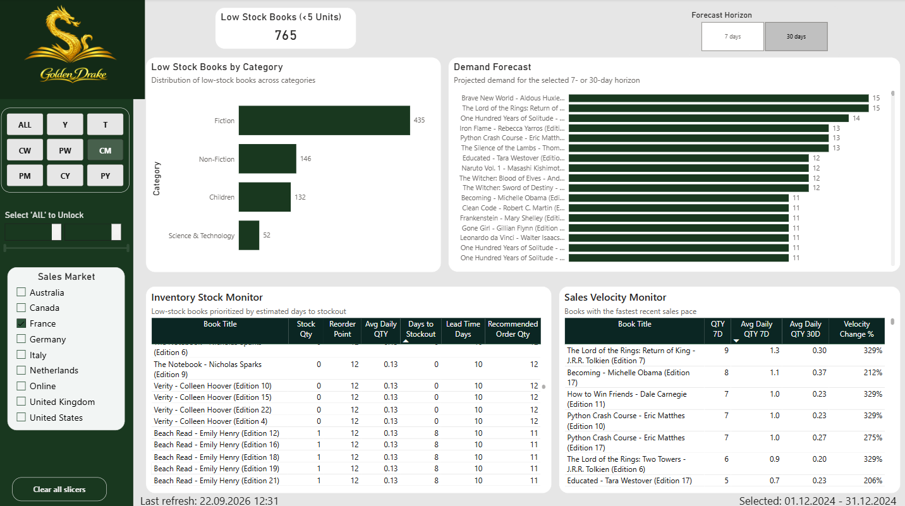
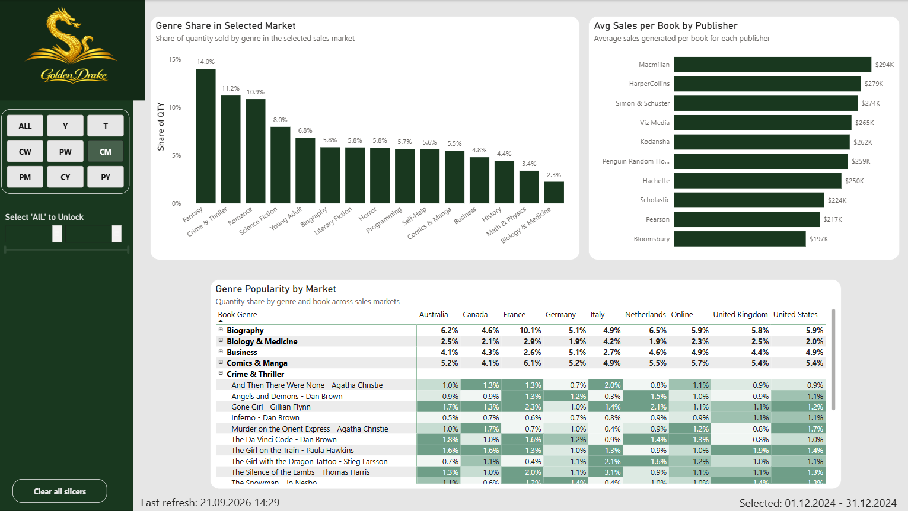
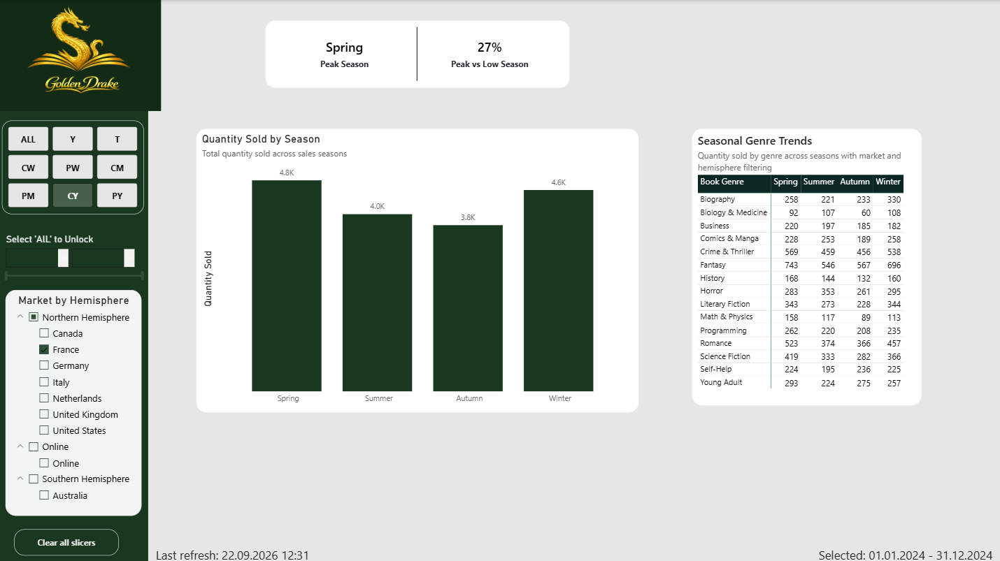
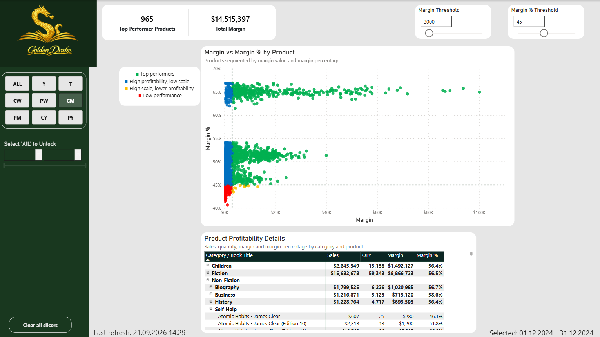
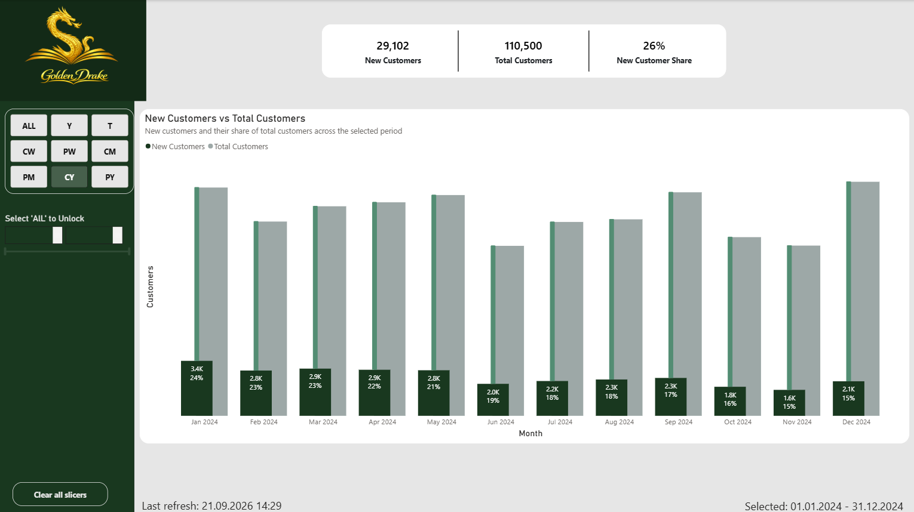

# GoldenDrake Bookstore - Power BI Portfolio Project

## Project Overview

GoldenDrake Bookstore is a fictional bookstore operating across multiple sales markets. This Power BI report focuses on sales performance, inventory monitoring, demand planning, seasonality, product profitability and customer growth.

The main goal of the project was to create an analytical report that supports daily sales monitoring and helps identify products that require inventory or ordering decisions.

## Business Context

GoldenDrake Bookstore operates in multiple markets and needs a more structured way to monitor sales and inventory levels.

The key business challenges include:

* sales across different countries and market groups,
* limited visibility into inventory levels,
* risk of order cancellations caused by stock shortages,
* the need for regular sales monitoring,
* the need to support ordering and demand planning decisions.

## Analysis Goals

The report was designed to answer the following business questions:

* Which books generate the highest sales?
* Which products have low stock levels?
* Which products should be reordered?
* How does sales performance differ between markets?
* Which book genres are most popular in selected countries?
* How does seasonality affect sales?
* Which products are the most profitable?
* How does the number of new customers change over time?

## Report Pages

* **Overview** - provides a high-level summary of sales, costs, margin, margin percentage and publisher performance.

* **Market Performance** - compares sales performance by country and market group, including store count, average sales per store and performance compared with the global average.

* **Top Products** - presents best-selling books by sales, quantity, category share and recent performance.

* **Inventory & Demand Planning** - focuses on low stock products, projected demand, recommended order quantities and sales velocity.

* **Genre Popularity Heatmap** - shows genre popularity across different sales markets based on the share of quantity sold.

* **Seasonality & Genre Trends** - analyzes seasonal sales patterns by book genre and hemisphere.

* **Product Profitability** - segments products by margin value and margin percentage to identify top performers and low-performing products.

* **Customer Growth** - compares new customers with total customers in the selected period.

## Data and Model

The data model is based on fact and dimension tables.

### Fact Tables

**fSales** - contains sales data, including sold products, quantities, sales values, costs, margins and transaction dates.

**fInventory** - contains inventory data, including stock quantity, reorder point, lead time and average sales.

### Dimension Tables

**dProduct** - contains information about books, categories, genres, publishers and product attributes.

**dStore** - contains information about stores, countries, sales markets and market groups.

**dDate** - contains calendar data used for time-based analysis and period filtering.

The data was loaded from a Lakehouse in Microsoft Fabric and transformed in Power Query.

## Key Measures and Logic

The report includes measures and calculations related to:

* total sales, total cost, margin and margin percentage,
* sales from the last 7 and 30 days,
* average daily sales,
* current stock quantity,
* days until stockout,
* recommended order quantity,
* projected demand,
* genre share by market,
* product profitability segmentation,
* new customer analysis.

## Tools Used

* Power BI
* Power Query
* DAX
* Microsoft Fabric / Lakehouse

## Screenshots

### Overview

### Market Performance

### Top Products

### Inventory & Demand Planning

### Genre Popularity Heatmap

### Seasonality & Genre Trends

### Product Profitability

### Customer Growth

## Project Status

This project was created as part of my data analytics portfolio. Its purpose is to demonstrate skills in Power BI, data modeling, DAX, business analysis, inventory and demand analysis, and data visualization.
